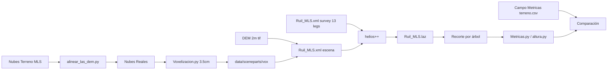

# Metodología paso a paso — simulación HELIOS++ Ruil_MLS

Proyecto: rodal **Ruil**, escaneo **MLS** (Stonex X120GO + VLP-16 simulado).  
Objetivo: reproducir la nube MLS con HELIOS++ y comparar métricas por árbol (3001–3079) con terreno y campo.

---

## 1. Requisitos

| Componente | Detalle |
|------------|---------|
| **HELIOS++** | Entorno Conda `helios` con `pyhelios` y binario `helios++` |
| **Python** | `laspy`, `numpy` (scripts en `Metricas/`) |
| **Cluster** | Slurm, partición `main`, ~512 GB RAM, 16 CPUs (job de referencia) |
| **Herramientas LAZ** | `lasmerge`, `las2las` (LASzip) en el mismo entorno |

Raíz del proyecto (assets): `/home/perazo/helios` (ajustar rutas si clonás en otro sitio).

---

## 2. Datos de entrada

### 2.1 Inventario y centros

- **Centros XY por árbol:** `Metricas/arboles_plot_metrics_xy.csv`
- **Métricas de campo (referencia):** `Metricas/Metricas terreno.csv` (DAP, altura, radios N/E/S/O)

### 2.2 Terreno

- **DEM 2 m:** `data/sceneparts/tif/DEM_Ruiles_2m.tif` (+ `.prj`)
- Material suelo en escena: `data/sceneparts/basic/groundplane/groundplane.mtl`

### 2.3 Nubes MLS por árbol (pre-simulación)

- **Originales segmentadas (MLS / Stonex):** carpeta `Metricas/Nubes Terreno/` — archivos `{3001..3079}.las` o `.laz`
  - Si las tenés solo en otra ruta (p. ej. `Nubes Stonex/`), usá `--input` en el paso 3.

### 2.4 Referencia de trayectoria (documentación)

- GeoJSON de campo: `data/trayectorias/Panoscanner - Trayectoria 1.geojson`  
  **No** lo lee HELIOS; los waypoints oficiales están en el survey XML (paso 5).

---

## 3. Alinear nubes MLS al DEM

**Script:** `Metricas/alinear_las_dem.py`

**Qué hace:** Para cada árbol, estima la base (XY de puntos cerca de `z_min`) y desplaza **Z** para que `z_min` coincida con la cota del DEM 2 m (interpolación bilinear).

**Salida:** `Metricas/Nubes Reales/{id}.las`  
**Registro:** `Metricas/las_dem_alignment.csv`

```bash
cd /home/perazo/helios
python3 Metricas/alinear_las_dem.py \
  --input Metricas/Nubes\ Terreno \
  --output Metricas/Nubes\ Reales \
  --dem data/sceneparts/tif/DEM_Ruiles_2m.tif
```

Opcional: `--dry-run` para revisar deltas sin escribir LAS.

---

## 4. Voxelizar árboles para HELIOS++

**Script:** `Metricas/Voxelizacion.py`

**Qué hace:** Discretiza cada nube alineada en voxels 3D y escribe formato `VOXEL SPACE` con `PadBVTotal=1.0` (voxel opaco).

| Parámetro producción | Valor |
|----------------------|-------|
| Tamaño voxel (`--vsize`) | **0.035 m** (3.5 cm) |
| Opacidad (`--pad`) | **1.0** |
| Entrada | `Metricas/Nubes Reales/` |
| Salida | `data/sceneparts/vox/{id}.vox` |

```bash
python3 Metricas/Voxelizacion.py --vsize 0.035 --pad 1.0
# Un árbol de prueba:
python3 Metricas/Voxelizacion.py --vsize 0.035 --only 3001
```

**Notas:**

- IDs **3000** y **3032** no forman parte del inventario estándar de simulación (3032 = segmentación; omitir en CSVs si aplica).
- La escena carga todos los vox con patrón `30[0-9][0-9].vox`.

---

## 5. Definir escena y survey HELIOS++

### 5.1 Escena — `data/scenes/Ruil_MLS.xml`

- **Geotiffloader:** DEM 2 m
- **detailedvoxels:** `data/sceneparts/vox/30[0-9][0-9].vox`

### 5.2 Survey — `data/surveys/Ruil_MLS.xml`

| Elemento | Configuración |
|----------|----------------|
| Plataforma | `data/platforms.xml#x120go_handheld` (montaje **45°** sobre eje X) |
| Escáner | `data/scanners_tls.xml#vlp16` |
| Escena | `data/scenes/Ruil_MLS.xml#Ruil_MLS` |
| **Legs** | **13** segmentos de trayectoria |
| Altura sensor | **z = 1.3 m** (`onGround="true"`) |
| Velocidad | **0.5 m/s** (`movePerSec_m`) |
| Template escáner | `x120go_v3`: 18 750 Hz, rotación 360°/s, muestreo trayectoria 0.05 s |

Coordenadas de inicio de cada leg: UTM en el XML (véase `platformSettings x/y`).

### 5.3 Catálogos

- `data/platforms.xml` — plataforma Stonex handheld
- `data/scanners_tls.xml` — modelo VLP-16

---

## 6. Ejecutar la simulación

### 6.1 Línea de comando (equivalente al job Slurm)

```bash
helios++ data/surveys/Ruil_MLS.xml \
  --lasOutput \
  --assets /home/perazo/helios \
  --output /home/perazo/helios/output \
  --rebuildScene \
  --njobs 16
```

### 6.2 Job Slurm — `run_Ruil_MLS.slurm`

1. Carga Conda y ejecuta `helios++` con los flags anteriores.
2. Localiza la carpeta de corrida bajo `output/MLS/20*/`.
3. Fusiona `leg*_points.las` → `output/Ruil_MLS.las` con `lasmerge`.
4. Comprime → **`output/Ruil_MLS.laz`** (LAS 1.4) con `las2las`.
5. Elimina subcarpetas temporales `output/MLS/`.

```bash
sbatch run_Ruil_MLS.slurm
```

**Salida principal:** `output/Ruil_MLS.laz` (~nube rodal simulada).

---

## 7. Post-proceso: métricas por árbol (comparación, no parte del motor HELIOS)

Tras **recortar o exportar** una nube por árbol desde `Ruil_MLS.laz` (p. ej. en `Metricas/Nubes HELIOS/`):

### 7.1 Altura

```bash
python3 Metricas/altura.py --set helios
python3 Metricas/altura.py --set terreno
```

### 7.2 Radios sectoriales y superficie de copa

**Script:** `Metricas/Metricas.py`

- Centro: CSV de centros
- Radios en azimuts **40°, 130°, 220°, 310°** (sectores ±25°)
- Superficie de copa: proyección XY en **rejilla 10×10 cm** (`area_grid_010_m2`)

```bash
python3 Metricas/Metricas.py --set terreno --input /ruta/a/nubes
python3 Metricas/Metricas.py --set helios --input /ruta/a/nubes
```

**CSV generados:**

- `Metricas/terreno/metricas.csv`
- `Metricas/helios/metricas.csv`

Figuras opcionales en `Metricas/terreno/figuras/` y `Metricas/helios/figuras/`.

### 7.3 Suelo / 3DFin (si aplica)

`Metricas/agregar_suelo.py --set helios|terreno`

---

## 8. Flujo resumido (diagrama)




*Documento alineado con `run_Ruil_MLS.slurm`, `data/scenes/Ruil_MLS.xml`, `data/surveys/Ruil_MLS.xml` y scripts en `Metricas/`.*
